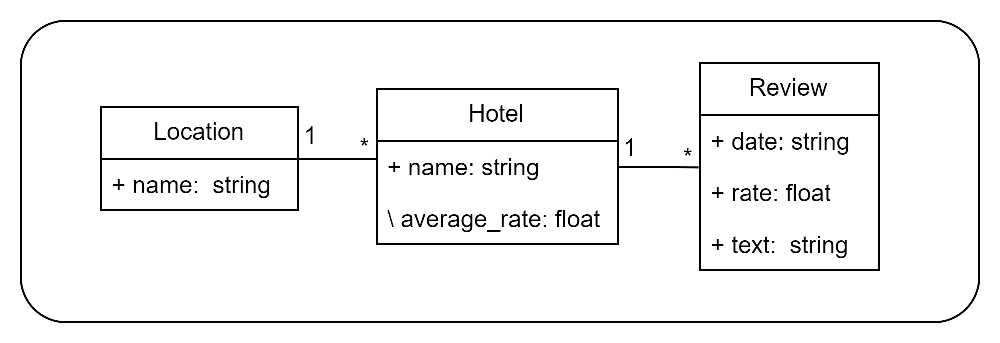
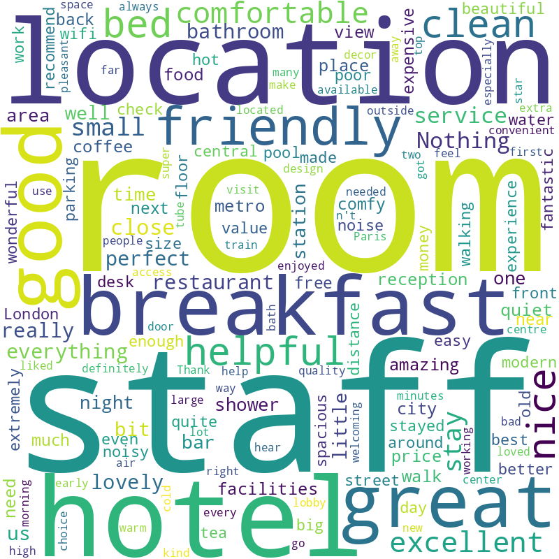
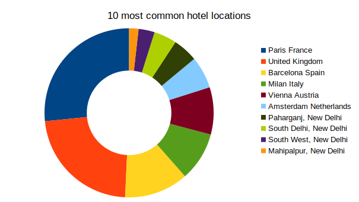
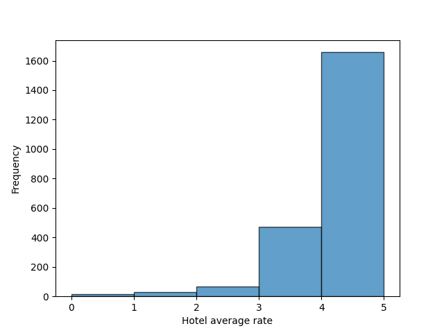
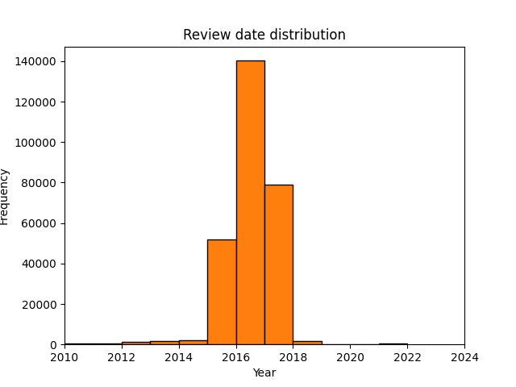
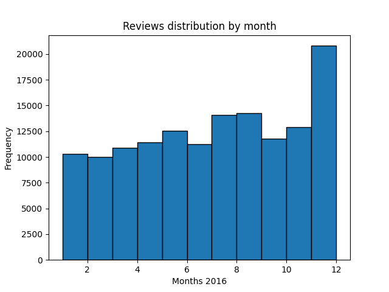

<h1 align = "center" >Hotel?</h1>
<p align = "center" >
  
</p>

<h3 align = "center" >PRI Project</h3>

### Run Web Interface

```bash
cd src/
make
```

And open [`localhost:3000`](http://localhost:3000).

### Run data pipeline

```bash
cd pipeline/
make
```

### Run Solr

```bash
cd solr
bash startup-final.sh
```

And open [`localhost:8983`](http://localhost:8983).

### Run queries

```bash
cd evaluation
python3 query.py M<2,3>             # to run all queries
python3 query.py <1,2,3,4>          # to run an individual milestone 2 query
python3 query.py <5,6,7,8>          # to run an individual milestone 3 query
```

### Run evaluation

```bash
cd evaluation
python3 evaluation.py M<2,3>        # for global milestone evaluation
python3 evaluation.py <1,2,3,4>     # for individual evaluation of milestone 2 queries
python3 evaluation.py <5,6,7,8>     # for individual evaluation of milestone 3 queries
python3 morelikethis.py             # for More Like This feature evaluation
```

## Manipulated Data

### Data Domain Model



### Word Cloud



### Location distribution



### Average review rating distribution



### Reviews distribution by year



### Reviews distribution by month - year 2016

