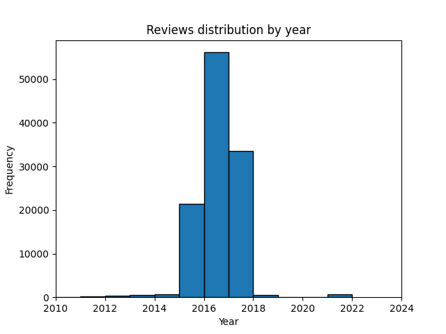

# PRI Project

### Run pipeline

```bash
cd pipeline/
make
```

### Run solr

```
cd solr
bash startup-(boosted|simple).sh
```

And open [`localhost:8983`](http://localhost:8983).

### Run queries

```
cd evaluation
make query [N]
```

### Run evaluation

```
cd evaluation
make evaluation [N]
```

## Data

### Data Domain Model


### Word Cloud


### Location distribution


### Average review rating distribution


### Reviews distribution by year



### Reviews distribution by month - year 2016

