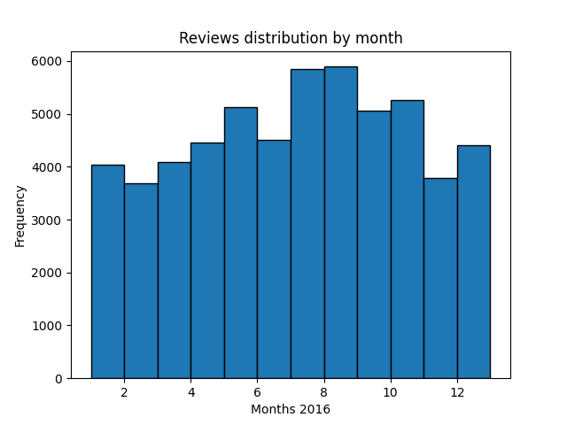

# PRI Project

## Data

### Data Domain Model


### Word Cloud


### Location distribution


### Average review rating distribution


### Reviews distribution by year


### Reviews distribution by month - year 2016



## Run 

```bash
cd pipeline/
make
```