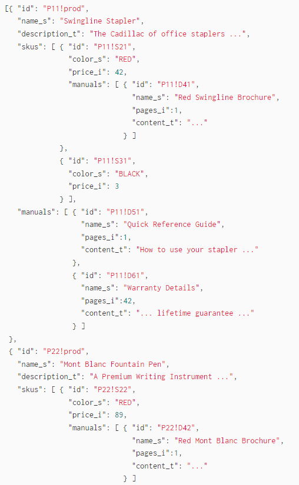

# Notes for M2

## What do we consider as documents on our dataset?
- hotels
- reviews

``If both``, we are dealing with nested documents (documents which contains another document).

### For Indexing Nested Documents - [Indexing](https://solr.apache.org/guide/solr/latest/indexing-guide/indexing-nested-documents.html)

>__Note:__ I dont think that we are using reviews as documents and by that we are getting lists on every attribute instead of nested documents with reviews as childs of hotels. \_root\_ and \_nest\_path\_ are declared but I think that we need to changed them to what we actually want.

>__``Reindexing Considerations``__
>
>With the exception of in-place updates, Solr must internally reindex an entire nested document tree if there are updates to it. For some applications this may result in a lot of extra indexing overhead that may not be worth the performance gains at query time versus other modeling approaches.

>The __``/update/json/docs``__ convenience path will automatically flatten complex JSON documents by default — so to index nested JSON documents make sure to use /update.

### For Searching Nested Child Documents - [Searching](https://solr.apache.org/guide/solr/latest/query-guide/searching-nested-documents.html)

### For quering parsing, instead of standard we should use DisMax and eDisMax. (Standard query parser is very strict)

## TODO
- change documents indexing
    - solr as \_root\_ document itself ??
    - hotels as childs of solr ??
    - reviews as childs of hotels
- create the necessary field-types and fields
    - with the necessary index and queries analyzers
- implement and evaluate two distinct retrieval setups
    - select 2 different "queries"
    - evaluate manually the returned results
    - ...