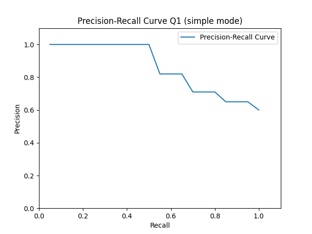
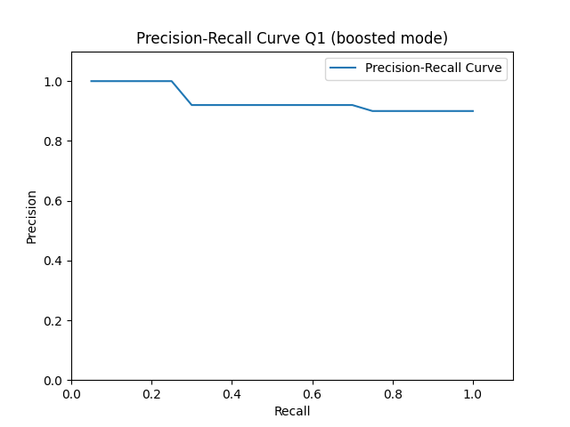
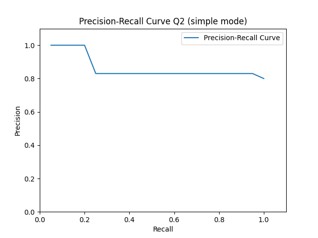
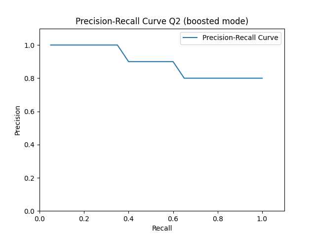
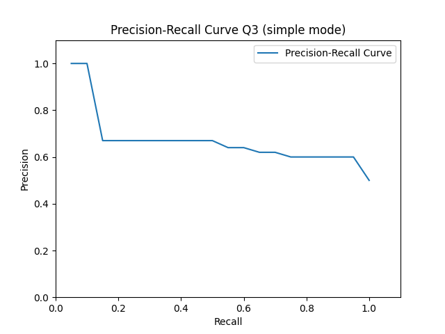
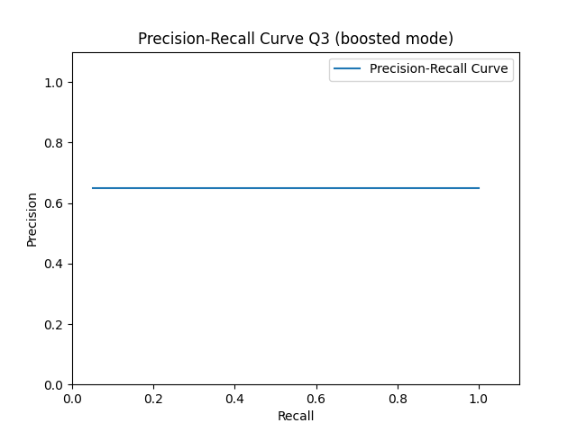
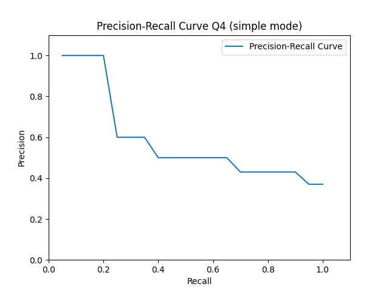
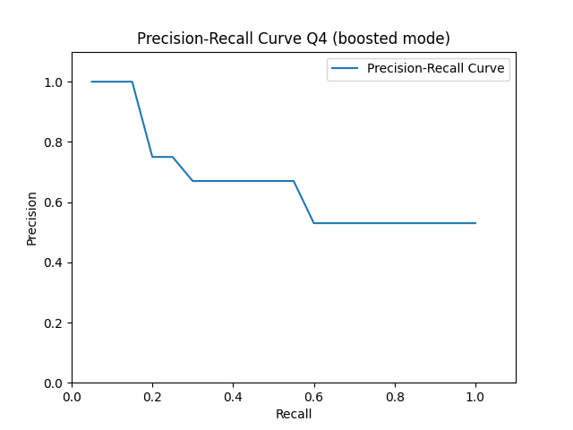

# Milestone 2 - Report

## Privago

#### André Ávila, Porto, up202006767@up.pt
#### André Costa, Porto, up201905916@up.pt
#### Fábio Morais, Porto, up202008052@up.pt
#### Fábio Sá, Porto, up202007658@up.pt

## 6. Information Retrieval

Information Retrieval [X1] is the process of finding and extracting relevant information from large collections of naturally unstructured data, such as texts. This extraction is based on documents, which are the result of restructuring the initial data, and the output is sorted by relevance, becoming the main challenge.

This section presents the indexing and query methods used in this information retrieval system powered by previously constructed documents. 

The implementation of the search system is based on Apache Solr [X2], an open-source tool that offers various features relevant to the project's purpose, including distributed and fast indexing, scalability, and advanced search capabilities surpassing a full-text match.

## 6.1 Document Characterization

The documents to be indexed and searched in the system are those resulting from the processes of data extraction, enrichment, and aggregation in the pipeline described above. 

Therefore, a hotel is a document consisting of a name, average rating, location, and has a set of associated reviews. These reviews have their corresponding date, the assigned rating, and the user's comment about the hotel.

## 6.2 Indexing Process

Indexing serves as a fundamental step in Information Retrieval, optimizing search efficiency by organizing the data. It involves creating a structured index that significantly enhances both search speed and scalability. Without proper indexing, search systems would face challenges, resulting in slower response times and increased computational overhead.

In Solr, various types of indexing exist for document fields and associated queries, based on a Tokenizer [X3] and Filters [X4]. While Tokenizers create a token stream from the original string following a predefined rule, Filters transform these tokens for consistency in subsequent searches and matches.

In this specific case, the focus was primarily on indexing textual fields, as they provide the most context and information for searches. Conversely, given the project's context, it is not expected to search for specific dates or review ratings. Therefore, these latter two document fields were not indexed.

Textual fields were indexed by instantiating a new data type. The `boosted_text` index analyzer includes:

- `StandardTokenizerFactory` tokenizer: splits texts based on punctuation and spaces;
- `ASCIIFoldingFilterFactory` filter: handles special characters and accents, converting them to their equivalent ASCII form;
- `LowerCaseFilterFactory` filter, converts all characters to their lowercase counterparts;
- `SynonymGraphFilterFactory` filter, expands each token to include variations based on its synonyms;
- `EnglishMinimalStemFilterFactory` filter, reduces each token to its root form, facilitating the search for variations of specific terms;

Fields with native values were defined using Solr's default types. The English language was chosen for both stem assignment and synonym generation, aligning with the language of the manipulated data.

The `SynonymGraphFilterFactory` is crucial in this context. Since the search is conducted based on reviews, which are inherently subjective, derived from natural language and rich in adjectives, it is important not to rely on specific terms but rather to match synonyms of terms.

The same structure was used for the query analyzer. Thus, the indexing of the final document can be characterized by the following schema:

| **Field**    | **Type**     | **Indexed** |
|--------------|--------------|--------------|
| name         | boosted_text | yes          |
| location     | boosted_text | yes          |
| average_rate | pdoubles         | yes          |
| date         | string       | no           |
| rate         | pdoubles         | no           |
| text         | boosted_text | yes          |

[Table T1]: Schema Field Types

## 6.3 Retrieval Process and Setup

The approach implemented involves two schemas: a simple schema utilizes default field types for each field, while the more complex schema incorporates instantiated field types for enhanced search capabilities. 

For query parameters used by both schemas, the system consolidates the following:

- __Query (``q``)__: Focuses on the most valuable words in the query;
- __Query Operator (``q.op``)__: Utilizes OR | AND for query operations;
- __Query Filter (``fq``)__: Defines a query that can be used to restrict the superset of documents;
- __Filter List (``fl``)__: Limits the information included in a query response;
- __Sort Field (``sort``)__: Specifies the sorting value for the results;

| **Parameter** | **value** |
|--------------|--------------|
| q | (strong wifi) |
| q.op | AND |
| fq | {!child of="\*:\* - _nest_path\_:*"} location:"New York" |
| fl | *,[child] |
| sort | score desc |

[Table T2]: Query parameters

The need of the fl and fq parameters results from the inclusion of nested documents [X8] [X9]. The final dataset consists of hotels, each containing a list of reviews. Recognizing the relevance of both hotels and reviews as distinct documents, a distinct approach to the search process was necessary. The combined use of fl and fq proved to be efficient in this step.

Additional query criteria the simple schema uses the default type, while the boosted schema employs the type created by eDismax [X5] with specific parameters for optimizing search engine results:

- __Query Field with Optional Boost (``qf``)__: This assigns weights to specific fields in the search;
- __Phrase-Boosted Field (``pf``)__: Focuses on selecting more relevant terms from the query;
- __Phrase Boost Slope (``ps``)__: Defines the maximum number of tokens between searched words;

| **Parameter** | **Value** |
|--------------|--------------|
| qf | text^7 name location^2 |
| pf | text^10 |
| ps | 3 |

[Table T3]: defType eDismax parameters

Assigning diverse weights within the `qf` parameter prioritizes the significance of the `text` field, being the main field of search, followed by `location` and `name`. In the `pf` parameter, exclusive attention is given to the `text` field, serving as a dedicated phrase boost. This is complemented by the `ps` parameter set to 3, an average number of maximum tokens between the searched words.

The eDismax parameter `bq` (boost query) was also explored in the approach but not included for system analysis. Since it relies on the characteristic tokens of each query, it was found that it would introduce bias to the results while configuring a system that wouldn't be general enough for all information needs.

Being consistent with this boosted approach to every query has enhanced the system's query handling, leading to improvements in search results, as elaborated in the subsequent section.

## 7. Evaluation

Evaluation is also a fundamental aspect of Information Retrieval, contingent on the target document collection and the type of information required. Understanding potential user scenarios is crucial for defining new designs and implementations based on received feedback. In this specific case, the evaluation was conducted from the perspective of effectiveness — the system's ability to find the right information — rather than efficiency, which pertains to the system's speed in retrieving information.

The use of individual and subjective metrics can introduce bias in evaluating the two previously instantiated systems. To address this, a set of distinct metrics based on `precision` and `recall`, such as `Average Precision (AvP)`, `Precision at K (P@K)`, `Precision-Recall curves`, and `Mean Average Precision (MAP)`, were employed. Precision focuses on the percentage of the number of truly relevant documents among those extracted, while recall makes this comparison based on all relevant documents within the system. Since there are more than 2000 unique documents in this case, precise calculation is impractical, leading to a manual approximation based on extracting and sampling the first twenty returned documents.

The `Average Precision (AvP)` is important because precision is what defines user satisfaction for the majority of users. In fact, users often do not require high recall since the percentage of relevant results given all important documents in the system is almost always unknown, unlike the relevance of the first returned documents. In `Precision at K (P@K)`, the choice was to evaluate the first twenty documents returned per query as it represents a balanced value aligning with typical usage patterns of a search engine.

The `Precision-Recall Curves` are constructed for each query and each system based on the subset of ranked documents returned. Ideally, a system is considered more stable the smoother its formed curve, and its performance is deemed better with a higher Precision-Recall Area Under the Curve [X6]. This metric encapsulates the overall effectiveness of the system in balancing precision and recall across thresholds.

The `Mean Average Precision (MAP)` is a common metric used in Information Retrieval and represents the average of Average Precision metric across various sets returned over the evaluation period. It helps determine if the system is consistent even when applied to different information needs.

In the upcoming topics, diverse user scenarios are presented as queries, accompanied by their respective results and statistics based on precision and recall metrics.

### A. Something

__Information Need:__ The best hotels near center of London
__Relevance Judgement:__  In this task, the objective is to find hotels near the center of London with the highest ratings. The search is conducted using keywords like 'center London' within the review text, United Kingdom as location and the results are sorted in descending order based on their rating.
__Query:__
- q: (center london)
- q.op: AND
- fq: {!child of=\"\*:* -_nest_path_:*\"}location:\"united kingdom\"
- fl: *,[child]
- sort: rate desc, score desc

| **Rank**    | **Syst. Simple**     | **Syst. Complex** |
|--------------|--------------|--------------|
| AvP         | 0.82 | 0.9 |
| P@20     | 0.6 | 0.9 |

[Table T4]: Q1 information need results

[Figure F1]: Q1 Precision-recall curve using simple system

[Figure F2]: Q1 Precision-recall curve using boosted system

__Result Analysis:__ Both systems did well, although there is a notable increased precision on the boosted system, demonstrated in the table [cite][Table T4]. The utilization of eDismax, in this query, proved to be important for the results since the 2 words "center london", when putted together, are very correlated with each other.

### B. Breakfast or Room Service

__Information Need:__ Hotels with good breakfast or good room service in New Delhi.
__Relevance Judgement:__ In this information need its intended to search for hotels with a good breakfast or a good room service in New Delhi. Therefore, the words "good breakfast" or "good room service" should appear in the same query/text of review and the location should be a filter query of the parents documents.
__Query:__
- q: (good breakfast) OR (good room service)
- q.op: AND
- fq: {!child of=\"\*:\* -_nest\_path\_:*\"}location:"new delhi"
- fl: *,[child]
- sort: score desc

| **Rank**    | **Syst. Simple**     | **Syst. Complex** |
|--------------|--------------|--------------|
| AvP         | 0.76 | 0.87 |
| P@20     | 0.8 | 0.8 |

[Table T5]: Q2 information need results

[Figure F3]: Q2 Precision-recall curve using simple system

[Figure F4]: Q2 Precision-recall curve using boosted system

__Result Analysis:__ The two systems have similar average precision, as it can be seen in table [cite][Table T5]. Since it is a very simple query, it is expected for good results from both systems and it is normal for the improved one to fail in some sentences since it's using the 'ps' parameter (which is equal for every query) that allows for tokens between searched words. This would be resolved with contextual analysis refered in the "Future Work"[cite] section. 

### C. Something

__Information Need:__ Hotel in the United Kingdom with good location and either elevator or good accessibility
__Relevance Judgement:__ With this query it is intended to gather the hotels situated in the United Kingdom which have a good location with either an elevator or good acessibility, a query for someone with reduced mobility that wants to visit the United Kingdom.
__Query:__
- q: good location ((elevator) OR (accessibility))
- q.op: AND
- fq: {!child of=\"\*:* -_nest_path_:*\"}location:\"united kingdom\""
- fl: *,[child]
- sort: score desc

| **Rank**    | **Syst. Simple**     | **Syst. Complex** |
|--------------|--------------|--------------|
| AvP         | 0.58 | 0.47 |
| P@20     | 0.5 | 0.65 |

[Table T6]: Q3 information need results

[Figure F5]: Q3 Precision-recall curve using simple system

[Figure F6]: Q3 Precision-recall curve using boosted system

Result Analysis: The systems differ in average performace, with the simple one overall performing better, as shown by the figure [cite][TABLE T6]. The reason for the complex system to score lower in the AvP (average performace) parameter but higher in the P@20 (precision) parameter however, is due to the system not taking the context into consideration, therefore, in a query that specifies the need for an elevator, the system gathers reviews that mention the absence of one. 

### D. Something

__Information Need:__ Hotels with good vegetarian/vegan options
__Relevance Judgement:__ In this task, the objective is to find hotels with good vegetarian or vegan options. So, the words "good vegetarian" or "good vegan" should appear in the review's text. The location isn't specified.
__Query:__
- q: (good vegetarian) OR (good vegan)
- q.op: AND
- fq: {!child of=\"\*:* -_nest_path_:\*\"}location:*
- fl: *,[child]
- sort: score desc

| **Rank**    | **Syst. Simple**     | **Syst. Complex** |
|--------------|--------------|--------------|
| AvP         | 0.5 | 0.55 |
| P@20     | 0.35 | 0.5 |

[Table T7]: Q4 information need results

[Figure F7]: Q4 Precision-recall curve using simple system

[Figure F8]: Q4 Precision-recall curve using boosted system

Result Analysis: Both systems exhibit similar average precision values, which fall below the anticipated values for a simple query. This can be attributed to the same issue discussed in Q2 [cite][Q2]. In fact, certain review texts were expressed in a negational form or contained nouns such as "lack," thereby altering the entire meaning of the sentence.

Taking into account all the results from the multiple information needs across queries, its presented in the following table the Mean Average Precision for both systems:

| **Global**    | **Syst. Simple**     | **Syst. Complex** |
|--------------|--------------|--------------|
| MAP | 0.665 | 0.6975 |

[Table T8]: Overall systems evaluation

Therefore, it is concluded that the system exhibits satisfactory performance, and, in general as anticipated, the more complex system is capable of yielding better results than the simple one.

## 8. Conclusions and Future work

In conclusion of this milestone, all the planned tasks within the Information Retrieval phase of the project have been successfully completed. This accomplishment marks a crucial turning point in the process of creating a useful hotel search engine that aids tourists in making informed choices.

One of the most challenging aspects of the work involved developing effective strategies for dealing with nested documents, as well as their indexing and retrieval. Solr lacks documentation and concrete examples supporting the addressed document format.

Through the evaluation of the search engine, the system's stability and capability to handle different information needs within the chosen context have been verified. As the project progresses, opportunities for further enhancements and refinements emerge. Analyzing the results obtained from the first prototype of the hotel's information retrieval system:

- The `Stop Words` [X7] filter can be applied to `boosted_text` to reduce sensitivity to common words;
- `Sentimental and contextual analysis` is relevant, given that the main source of information for the system is reviews, which inherently carry subjective connotations;

In the next phase, work will be done on user interfaces by developing a frontend for the search system, incorporating specific features like snippet generation and results clustering. This engine will enable travelers to explore and filter accommodations based on preferences, such as location, room quality, staff service, or other factors identified during the analysis phase.

## References

Todos os anteriores mais:

- [X1] - [Information Retrieval](https://link.springer.com/book/10.1007/978-3-319-93935-3), 2023/10/23
- [X2] - [Apache Solr](https://solr.apache.org/guide/6_6/introduction-to-solr-indexing.html), 2023/10/23
- [X3] - [Solr Tokenizers](https://solr.apache.org/guide/solr/latest/indexing-guide/tokenizers.html), 2023/11/02
- [X4] - [Sorl Filters](https://solr.apache.org/guide/solr/latest/indexing-guide/filters.html), 2023/11/02
- [X5] - [eDismax](https://solr.apache.org/guide/7_7/the-extended-dismax-query-parser.html), 2023/11/04
- [X6] - [Precision-Recall Area Under the Curve](https://scikit-learn.org/stable/auto_examples/model_selection/plot_precision_recall.html), 2023/11/07
- [X7] - [Solr Stop Filter](https://solr.apache.org/guide/solr/latest/indexing-guide/filters.html#managed-stop-filter), 2023/11/07
- [X8] - [Indexing Nested Documents](https://solr.apache.org/guide/solr/latest/indexing-guide/indexing-nested-documents.html#schema-configuration), 2023/11/11
- [X9] - [Queries in Nested Documents](https://solr.apache.org/guide/solr/latest/query-guide/searching-nested-documents.html), 2023/11/11