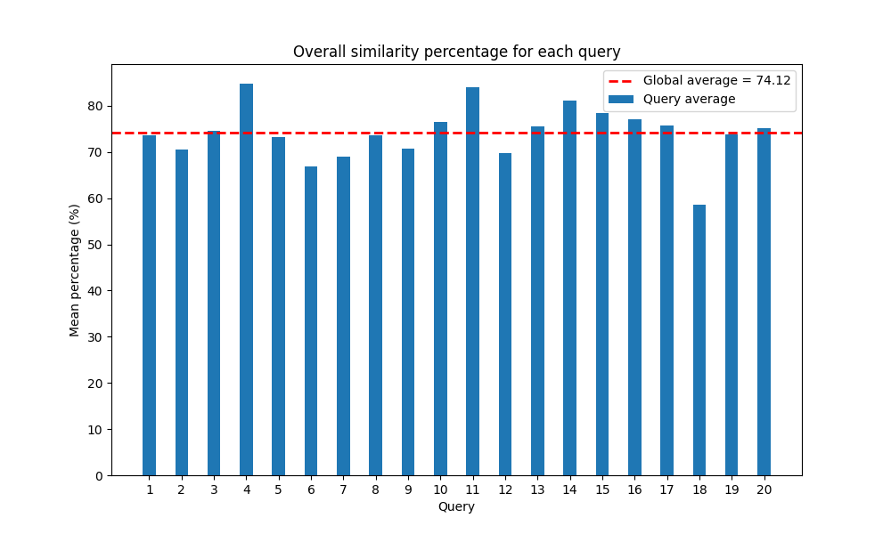

# Milestone 3 - Report

## Privago

#### André Ávila, Porto, up202006767@up.pt
#### André Costa, Porto, up201905916@up.pt
#### Fábio Morais, Porto, up202008052@up.pt
#### Fábio Sá, Porto, up202007658@up.pt

## 8. Information Retrieval Improvements

The previous stage introduced an initial version of the information retrieval system, evaluating it based on well-defined information needs and metrics grounded in precision and recall. Looking from another perspective, it also helped identify the weaknesses and limitations of the chosen approaches. Therefore, to enhance the search engine, this phase will involve the implementation and evaluation of features aimed at addressing the identified gaps:

- Stop Words;
- Semantic Analysis;

The evaluation of these features will follow the same style as the previous ones, using real information needs as a base and adjusting them to the context encountered. There will still be two systems under analysis, this time the boosted system and the boosted system with the application of the improvement under study. Evaluating each improvement separately allows for both an isolated analysis of its contribution to the system's success and a discussion on its permanence in the final search engine.

Three information needs will be used. The first two will be the same as in the previous stage, ensuring a valid comparison of the systems when exposed to the same environment and providing a visualization of the progressive development of the hypothesis. There will also be a comparison of the systems using a third information need, this time tailored to the improvement's objective, adding extra stress to the system on the topic we want to explore and checking the system's ability to handle the adversities of the natural language characteristic of these searches.

Table [T1] documents the relevance of the top 20 results for each evaluated query and for the two improvements under analysis.

In order to explore the project's theme more focusedly, *More Like This* [X0] has been added to the list of improvements, with consequent analysis. Balancing the benefits of each of the topics addressed brings us even closer to what a contemporary information retrieval system looks like today.

### A. Stop Words    

The decision to implement a stopwords filter aimed at enhancing the exploration of complex queries, allowing clients more flexibility to conduct searches with more complex queries. Solr initially provides a set of predefined stopwords, but a custom file was chosen, derived from a word cloud diagram. Similar to the process for Synonyms, this custom stopwords file was incorporated into the Solr configuration files.

Two queries from Milestone 2 were reviewed in the following queries, each with a single stopword. When compared to the previous strategy, the new approach added two query parameters: stopwords and ignorecase, both of which were set to true, indicating that stopwords would be investigated regardless of capitalization.

#### Breakfast or Room Service

__Information Need:__ Hotels with good breakfast or good room service in New Delhi.
__Relevance Judgement:__ In this information need its intended to search for hotels with a good breakfast or a good room service in New Delhi. Therefore, the words "good breakfast" or "good room service" should appear in the same query/text of review and the location should be a filter query of the parents documents.
__Query:__
- q: (good breakfast) OR (good room service)
- q.op: AND
- fq: {!child of=\"\*:\* -_nest\_path\_:*\"}location:"new delhi"
- fl: *,[child]
- sort: score desc
- stopwords: true
- ignoreCase: true

### Vegetarian/Vegan

__Information Need:__ Hotels with good vegetarian/vegan options
__Relevance Judgement:__ In this task, the objective is to find hotels with good vegetarian or vegan options. So, the words "good vegetarian" or "good vegan" should appear in the review's text. The location isn't specified.
__Query:__
- q: (good vegetarian) OR (good vegan)
- q.op: AND
- fq: {!child of=\"\*:* -_nest_path_:\*\"}location:*
- fl: *,[child]
- sort: score desc
- stopwords: true
- ignoreCase: true

### Beach Views

__Information Need:__ Best hotels with beach views.
__Relevance Judgement:__ In this task, the objective is to find the best hotels with beach views. Since we are using the StopWords Filter, only the words "best hotels beach views" will be search in each review text. 
__Query:__
- q: What are the best hotels with beach views
- q.op: AND
- fq: {!child of=\"\*:* -_nest_path_:\*\"}location:*
- fl: *,[child]
- sort: score desc
- stopwords: true
- ignoreCase: true

Upon analyzing the results in each table, it is clear that the results of the two previous queries differ, as expected. The use of the stopwords filter during indexing and querying causes a difference in results. Considering that the query only contains one stopword, the results show a noticeable similarity even though they are not identical.

In contrast, the third query, which has four stopwords, produced no results in the original schema without the stopwords filter. The modified schema, on the other hand, provided the expected 20 outcomes with a precision of 13 out of 20, as shown in the [table].

In conclusion, the integration of a stopwords filter provides the advantage of handling more complex queries, granting clients greater freedom in their search parameters. This enhancement contributes to the complexity and accuracy of the search results, ultimately improving the overall search system.

### B. Semantic Analysis

-> Justificar o porquê da decisão de colocar esta feature
-> Indicar se o Solr suporta, adicionar referências importantes [X2];

-> QX1 (seguir a estrutura de M2)

-> Information Need
-> Relevance Judgement
-> Query
-> Tabela com AvP e P@20 para System Boosted, System Boosted + Semantic Analysis
-> Result Analysis, não esquecer de justificar as precision-recall curves

-> QX2 (seguir a estrutura de M2)

-> Information Need
-> Relevance Judgement
-> Query
-> Tabela com AvP e P@20 para System Boosted, System Boosted + Semantic Analysis
-> Result Analysis, não esquecer de justificar as precision-recall curves

-> QX3 (seguir a estrutura de M2)

-> Information Need
-> Relevance Judgement
-> Query
-> Tabela com AvP e P@20 para System Boosted, System Boosted + Semantic Analysis
-> Result Analysis, não esquecer de justificar as precision-recall curves

-> No final, avaliar os dois sistemas com base no MAP
-> Justificar se esta feature vai ou não para o sistema final

### C. More Like This

Within Solr, the More Like This (MLT) functionality empowers users to discover documents similar to a specified document. Solr's More Like This is a Lucene [X3] built-in functionality that operates by scrutinizing the text within the provided document and subsequently identifying other documents in the index that exhibit textual and contextual similarities. The outcomes of this query comprise documents with the most elevated similarity scores.

An approach to this feature is particularly suitable and crucial in the context of the current project. Given the inherent subjectivity in choosing hotels due to tourism, users are expected to want to find more areas or hotels aligned with their preferences.

Thus, from a hotel review, the system finds another 10 with similar content and corresponding hotels. These results are computed and ordered by Solr's internal match score. The parameters used in the queries were as follows:

- `mlt.fl = text`, the similarity comparison will always be based on the text between reviews, as this text contains the context of the evaluation;
- `mlt.mintf = 2`, (Lucene's default number), the minimum number of matches between terms for the document to be considered valid;
- `mlt.mindf = 5`, (Lucene's default number), the minimum number of valid documents for the search to be considered valid;

Although the More Like This feature allows for boosts in certain parameters, this was not utilized. It would not make sense to create an additional boost for the fields of the document being processed since we only applied the functionalities of MLT to the text field in the review. Applying the boost to specific terms or tokens would distort the concept of a global search system capable of analyzing each query in a balanced manner by favoring the emergence of some words.

The evaluation of this improvement does not follow the approach of previous information needs. The comparison of semantics and similarity between two texts can be even more complex and subjective when done manually. As such, we chose to evaluate the relevance of these queries using the objectivity of the Python SpaCy library [X4]. SpaCy specializes in advanced natural language processing (NLP) and allows for the comparison and quantification of similarity between two texts through their context.

After collecting a sample from the system, where 20 reviews were randomly selected, along with the corresponding 10 reviews most similar according to Solr's output, the degree of similarity of their texts was externally computed. The result of the average similarity between the first ten results of each MLT query is described in Figure [F1].

 

[F1] - Average similiarity percentage for each query

The overall average similarity between the queries is quite high, never falling below 60% in this sample. On the other hand, since it is a document ranking system, it is important to know the level of similarity decay with the index of the outputs. Theoretically, it is expected that the documents at the top have a higher degree of similarity than the others. To assess this behavior, the corresponding degree of similarity was computed for each index of the output. The mean similarity evolution across indexes can be found in Figure [F2]:

 

[F2] -  Evolution of average similiarity across result indexes

Contrary to expectations, there was no inverse relationship in the selected sample between the degree of similarity of the original query and the index of the document. This fact can be justified in two ways. On the one hand, since the number of reviews in the dataset is much higher than the output of the MLT system, there was no spacing to notice a noticeable difference in the ranking of the results. On the other hand, the score from SpaCy is different from Solr's internal score, to which we do not have access, leading to some fluctuations.

With good results, this feature will be present in the final system.

## 9. Search User Interface

While Solr's interface provides a valid approach to the search system and query customization, it deviates from traditional information retrieval system platforms. In this phase, the focus shifts to user interfaces by developing a frontend in NodeJS [X5] using Solr's API [X6] for the search system. This engine will empower travelers to explore and filter accommodations based on preferences, such as location, room quality, staff service, or other factors identified during the analysis phase.

Thus, four pages have been developed to support these needs, featuring a minimalist and responsive design for an enhanced user experience:

- `Home`, depicted in Figure [F3], where users can initiate searches and preview the best hotels in the system;
- `Search`, illustrated in Figure [F4], showcasing the results of the searches;
- `Hotel`, presented in Figure [F5], displaying comprehensive information about the hotel, along with all its reviews;
- `More Like This`, shown in Figure [F6], presenting results from similar searches;

It is also possible to apply filters to searches, in addition to specifying the query. Users can filter results by location, review rating given, and the hotel's average rate.

Each result is accompanied by all relevant information for assessing its relevance, such as the hotel's name, ratings, review text, and application date. All results are returned in descending order of ranking, ensuring that the first ones are the most relevant given the underlying context of the query and applied filters.

De forma a avaliar aspectos qualitativos globais da plataforma, foram selecionados utilizadores comuns de plataformas do são convidados no final da sessão de experimentação a responder a um breve questionário. Esse questionário foi elaborado usando a versão standard da System Usability Scale (SUS). Esta escala contempla questões que avaliam a percepção do utilizador acerca da usabilidade e pertinência geral da aplicação, bem como na clareza de cada funcionalidade implementada:

1. I think that I would like to use this system frequently.
2. I found the system unnecessarily complex.
3. I thought the system was easy to use.
4. I think that I would need the support of a technical person to be able to use this system.
5. I found the various functions in this system were well integrated.
6. I thought there was too much inconsistency in this system.
7. I would imagine that most people would learn to use this system very quickly.
8. I found the system very cumbersome to use.
9. I felt very confident using the system.
10. I needed to learn a lot of things before I could get going with this system.

Os resultados 

Os resultados... foram bons porque... experts, semelhante a outros search systems conhecidos...

## 10. Final System Characterization

Indicar aqui que funcionalidades são aplicadas, por tópicos

com MAP X, a estas features adiciona-se ainda o MLT com acuracy Y e uma user interface avaiada em W.

aO LONGO DE TRES ITERAÇÕES, LOGO TÁ FIZE PARA AVABAR EM GRANDEII

## 11. Conclusions and Future Work

(modificar, este é o de M2)

-> adicionar filtro de location no mlt para future work

In conclusion of this milestone, all the planned tasks within the Information Retrieval phase of the project have been successfully completed. This accomplishment marks a crucial turning point in the process of creating a useful hotel search engine that aids tourists in making informed choices.

One of the most challenging aspects of the work involved developing effective strategies for dealing with nested documents, as well as their indexing and retrieval. Solr lacks documentation and concrete examples supporting the addressed document format.

Through the evaluation of the search engine, the system's stability and capability to handle different information needs within the chosen context have been verified. As the project progresses, opportunities for further enhancements and refinements emerge. Analyzing the results obtained from the first prototype of the hotel's information retrieval system:

- The `Stop Words` [X7] filter can be applied to `boosted_text` to reduce sensitivity to common words;
- `Sentimental and contextual analysis` is relevant, given that the main source of information for the system is reviews, which inherently carry subjective connotations;

In the next phase, work will be done on user interfaces by developing a frontend for the search system, incorporating specific features like snippet generation and results clustering. This engine will enable travelers to explore and filter accommodations based on preferences, such as location, room quality, staff service, or other factors identified during the analysis phase.

## References

Todas as anteriores mais:

- [X0] - [More Like This in Solr](https://solr.apache.org/guide/8_8/morelikethis.html)
- [X1] - Referências de Stop Words
- [X2] - Referências de Semantic Analysis. Uma delas tem de ser obrigatoriamente o Tutorial do regente
- [X3] - [Lucene Solr](https://lucene.apache.org/core/9_9_0/index.html)
- [X4] - [Python SpaCy](https://spacy.io)
- [X5] - [NodeJS](https://nodejs.org/en/about)
- [X6] - [Solr's API](https://solr.apache.org/guide/8_5/client-apis.html)
- [X7] - [System Usability Scale](https://www.usability.gov/how-to-and-tools/methods/system-usability-scale.html)
- [X8] - [SUS Evaluation Form](https://docs.google.com/forms/d/e/1FAIpQLSeaWvSApBxHiT_iXDgFF1eJ9HGKVdpSvcWV558pGX2PYa6Iqw/viewform)

## Annexes

[T1] - Tabela com 0s e 1s, com 20 linhas e colunas suficientes para suportar os improvements e a comparação entre o boosted e a nova approach;
[F3] - Home page print
[F4] - Search page print
[F5] - Hotel page print
[F6] - More Like This page print